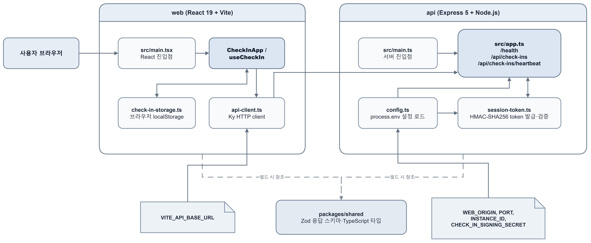
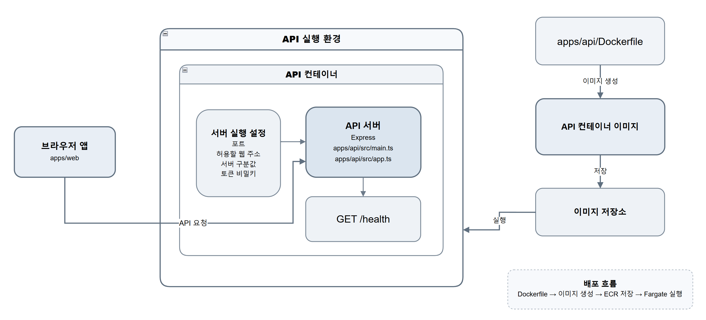

# live-check-in-demo

발표 현장에서 청중이 휴대폰으로 한 번 참여하고, 약 60초 동안 연결 상태를 유지하는 독립 샘플 애플리케이션입니다.

## 사용자 흐름

1. 청중이 `참여하기`를 한 번 누릅니다.
2. frontend가 API에서 약 60초 동안 유효한 서명된 임시 session token을 받습니다.
3. frontend가 token을 `Authorization` 헤더에 넣어 약 60초 동안 3초 간격으로 heartbeat를 순차적으로 보냅니다.
4. 버튼은 즉시 비활성화되고 `참여 중 · 연결됨` 상태가 표시됩니다.
5. 60초가 지나면 요청을 중단하고 `참여 완료` 상태를 표시합니다.

## 폴더 구조

```text
live-check-in-demo/
├── apps/
│   ├── web/
│   │   ├── src/
│   │   ├── index.html
│   │   ├── package.json
│   │   ├── tsconfig.json
│   │   └── vite.config.ts
│   └── api/
│       ├── src/
│       ├── package.json
│       ├── tsconfig.json
│       └── Dockerfile
├── packages/
│   └── shared/
│       ├── src/
│       ├── package.json
│       └── tsconfig.json
├── .env.example
├── package.json
├── package-lock.json
├── README.md
└── tsconfig.base.json
```

## Architecture Overview


## Stateless API Container

`apps/api`는 체크인 요청과 heartbeat를 처리하는 독립 HTTP API입니다. Dockerfile, 환경 변수 기반 설정, health endpoint를 갖추고 있어 컨테이너 실행 환경에 맞춰 구성되어 있습니다.



### 요청 증가에 대응하는 구조
- 체크인 API는 서버 메모리에 세션을 저장하지 않습니다. apps/api/src/session-token.ts는 session ID, 발급 시각, 만료 시각을 포함한 HMAC-SHA256 서명 token을 발급합니다.
- heartbeat 요청은 token을 Authorization: Bearer 헤더로 전달합니다. 각 API 컨테이너는 같은 CHECK_IN_SIGNING_SECRET을 사용하면 자신이 발급하지 않은 token도 검증할 수 있습니다.
- 따라서 특정 API 프로세스에 세션 상태가 묶이지 않습니다. 요청량이 증가할 때 여러 컨테이너가 같은 방식으로 체크인과 heartbeat를 처리할 수 있습니다.
- INSTANCE_ID는 heartbeat 응답의 servedBy에 포함됩니다. 개발 환경에서는 어떤 API 인스턴스가 요청을 처리했는지 확인할 수 있습니다.
- 웹 앱은 session token을 브라우저 localStorage에 만료 시점까지만 임시 저장하고, API는 이를 영속 저장하지 않습니다.

### Docker Runtime
- apps/api/Dockerfile은 API와 packages/shared를 multi-stage build로 빌드한 뒤, production dependency와 빌드 결과만 포함한 Node 22 Alpine 이미지를 만듭니다.
- 컨테이너는 비루트 node 사용자로 실행됩니다.
- 기본 포트는 8080이며, PORT 환경 변수로 변경할 수 있습니다.
- GET /health endpoint와 Docker HEALTHCHECK가 준비되어 있습니다.
- WEB_ORIGIN, INSTANCE_ID, CHECK_IN_SIGNING_SECRET은 이미지에 고정하지 않고 실행 시 환경 변수로 전달합니다.

이 API는 컨테이너 단위로 실행할 수 있고 서버 간 공유 세션 저장소를 요구하지 않으므로, ECS Fargate와 같은 container runtime에서 여러 API task를 운영하는 구조와 잘 맞습니다. 다만 실제 task 수, 자동 확장 기준, 네트워크 구성, 외부 health check 구성은 이 저장소에 정의되어 있지 않습니다.

## Application Units

### web

- path: `apps/web`
- framework: React
- language: TypeScript
- build tool: Vite
- install command: `npm ci`
- build command: `npm run build --workspace apps/web`
- build output: `apps/web/dist`
- required environment variable: `VITE_API_BASE_URL`
- hosting: Vite build output은 S3 같은 static hosting에 배포할 수 있습니다.

### api

- path: `apps/api`
- framework: Express
- runtime: Node.js
- language: TypeScript
- install command: `npm ci`
- build command: `npm run build --workspace apps/api`
- start command: `npm run start --workspace apps/api`
- port: `8080` 기본값, `PORT`로 변경 가능
- health check path: `/health`
- application API prefix: `/api`
- Dockerfile path: `apps/api/Dockerfile`
- container entrypoint: `npm run start --workspace apps/api`
- required runtime environment variables: `WEB_ORIGIN`, `PORT`, `INSTANCE_ID`, `CHECK_IN_SIGNING_SECRET`

## 환경 변수

`.env.example`은 필요한 변수 이름과 로컬 기본값을 보여주는 참고 파일입니다. 로컬 shell에서 export하거나 SketchCatch/AWS 배포 설정으로 주입하세요.

- `PORT`: API가 듣는 포트. 기본값은 `8080`입니다.
- `WEB_ORIGIN`: CORS를 허용할 frontend origin. 기본값은 `http://localhost:5173`입니다.
- `VITE_API_BASE_URL`: Vite frontend가 호출할 API 주소. 기본값은 `http://localhost:8080`입니다.
- `INSTANCE_ID`: heartbeat 응답의 `servedBy` 값. 생략하면 hostname을 사용합니다.
- `CHECK_IN_SIGNING_SECRET`: HMAC-SHA256 session token 서명 키. production에서는 UTF-8 기준 최소 32바이트가 필수입니다.

로컬 또는 production용 값을 새로 만들 때 다음 명령을 사용합니다. 생성된 값은 Git에 저장하지 마세요.

```bash
openssl rand -base64 32
```

production API는 `CHECK_IN_SIGNING_SECRET`이 없거나 32바이트보다 짧으면 시작하지 않습니다. 개발 환경에서 변수가 없으면 안전하지 않은 개발 전용 기본값과 명확한 경고를 사용하므로 배포 환경에서는 반드시 명시적으로 설정해야 합니다.

## 로컬 실행

Node.js 22 이상과 npm이 필요합니다.

```bash
npm ci
export CHECK_IN_SIGNING_SECRET="$(openssl rand -base64 32)"
npm run dev
```

frontend는 `http://localhost:5173`, API는 `http://localhost:8080`에서 실행됩니다.

## 빌드, 타입 검사, lint, 테스트

```bash
npm run build
npm run typecheck
npm run lint
npm test
```

전체 build는 shared 타입을 먼저 만들고 API와 frontend를 각각 빌드합니다. API는 `dist/main.js`, frontend는 `apps/web/dist`에 결과를 만듭니다.

## API endpoints

### `GET /health`

```json
{
  "status": "ok",
  "service": "live-check-in-api",
  "version": "1.0.0"
}
```

### `POST /api/check-ins`

### `POST /api/traffic`

본문과 사용자 데이터를 저장하지 않고 `204 No Content`를 반환하는 관측용 traffic probe입니다.
SketchCatch Live Observation collector가 배포된 CloudFront/ALB/ECS 경로에 실제 요청을 한 번 더 전달할 때 사용합니다.

### SketchCatch 실시간 관측 신호

SketchCatch가 발급한 청중 참여 URL에는 다음 query parameter가 포함될 수 있습니다.

```text
sketchcatch_observation_url=https://<sketchcatch-origin>/api/live-observations/public/<observation-id>
```

frontend는 실제 check-in 또는 heartbeat 요청이 성공한 뒤에만 이 주소로 best-effort 관측 신호를
보냅니다. 먼저 `/bootstrap`에서 짧은 수명의 capability를 받고, 이후 `/receipts`에 무작위
event ID를 전송합니다. capability는 query string이나 localStorage에 저장하지 않습니다.

관측 신호 전송이 실패해도 청중의 check-in과 heartbeat 흐름은 계속됩니다. 따라서 SketchCatch
화면은 Store receipt로 요청 급증을 약 1초 안에 표시할 수 있고, CloudWatch ALB 지표는 AWS의
기본 발행 주기에 따라 뒤늦게 보강 증거로 표시됩니다.

개인정보 없이 HMAC-SHA256으로 서명한 opaque session token, 만료 시각, heartbeat 간격을 반환합니다. 무작위 UUID session ID는 token payload 안에만 들어가며 URL에는 노출되지 않습니다.

```json
{
  "sessionToken": "<opaque-signed-token>",
  "expiresAt": "2026-07-20T00:01:00.000Z",
  "heartbeatIntervalMs": 3000
}
```

### `POST /api/check-ins/heartbeat`

token은 URL path나 query가 아니라 Bearer Authorization 헤더로 전달합니다.

```http
POST /api/check-ins/heartbeat HTTP/1.1
Authorization: Bearer <sessionToken>
Content-Type: application/json
```

유효한 token이면 `ok`, `receivedAt`, `servedBy`를 반환합니다. `servedBy`는 `INSTANCE_ID` 또는 hostname이므로 개발 환경에서 요청을 처리한 Task를 확인할 수 있습니다. Authorization 누락, 서명 불일치, 변조, 만료 token은 동일한 JSON 형식의 `401 invalid_session`으로 거절합니다.

존재하지 않는 route는 일관된 JSON `404`, 잘못된 JSON은 `400`, 처리되지 않은 서버 오류는 일관된 JSON `500`으로 응답합니다. CORS는 `Authorization`과 `Content-Type`을 허용하고 요청 body 제한은 `16kb`입니다. 애플리케이션 요청 로그에는 method와 status만 기록하며 token, secret, IP, User-Agent와 원문 오류 메시지는 기록하지 않습니다. ALB나 WAF 같은 인프라 access log의 보존 정책은 배포 환경에서 별도로 관리해야 합니다.

## Docker

API 이미지는 multi-stage Dockerfile로 빌드합니다.

```bash
docker build -f apps/api/Dockerfile -t live-check-in-api .
export CHECK_IN_SIGNING_SECRET="$(openssl rand -base64 32)"
docker run --rm -p 8080:8080 \
  -e INSTANCE_ID=local-container \
  -e CHECK_IN_SIGNING_SECRET \
  live-check-in-api
curl http://localhost:8080/health
```

이미지는 production dependency만 포함하고 `node` non-root 사용자로 실행합니다. `EXPOSE 8080`과 container health check는 `/health`를 사용합니다.
